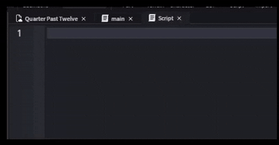

# luauMacros

Simple macro system as a Roblox Studio plugin for the Luau language.



## Functionalities

After installing the plugin, you can add certain keywords for your macros, which work globally. While editing any script, typing the macro keyword will automatically make it expand to the text of your choosing once you press space.

## Things to be implemented

- A smarter buffer system which supports smart buffer rebuilding. This should currently not be an issue unless you are trying to find issues with the buffer system. <br>
- Macros not expanding in comments. <br>
- A better UI/UX, with bulk deleting and prettier outputs. <br>
- A settings menu. You would be able to toggle things such as, but not limited to:

- Whether to flush or smart rebuild the buffer on Ctrl + Z / Ctrl + Backspace deletions <br>
- Whether macros are enabled or not (would retire the current button) <br>
- Tab or space to expand macros <br>

- Variable macros. The syntax which is proposed is as so:

```lua

macro name = fn <param> <param2> <param3> ...

macro expansion = local a = <param>; local b = <param2>; local function <param3>()

to call the macro, you would do:

fn(5,7,"a") -- This would expand the macro into:

local a = 5; local b = 7; local function a()

```

While this could be promising, it also has the side effect of making less than or greater than symbols be mixed up for parameters when they mean something else in context.


